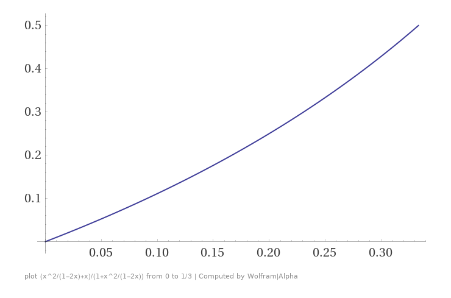

# BitPeople: A Proof-of-Unique-Human System
Johan Nygren, johanngrn@gmail.com

ABSTRACT: BitPeople is based on pseudonym events, global and simultaneous verification events that occur at the exact same time for every person on Earth. In these events, people are randomly paired together, 1-on-1, to verify that the other is a person, in a pseudo-anonymous context, over video chat. The event lasts 15 minutes, and the proof-of-unique-human is that you are with the same person for the whole event. The proofs, valid for a month, can be disposed of once no longer valid, and are untraceable from month to month.

### Introduction, or What is it like to be a nym?
BitPeople is a population registry for a new global society that is built on top of the internet. It provides a simple way to give every human on Earth a proof-of-unique-human, and does so in a way that cannot exclude or reject a human being, as long as the average person in the population would recognize them as human. This means it is incapable of shutting anyone out, and that it will inherently form a single global population record, that integrates every single human on Earth. It is incapable of discrimination, because it is incapable of distinguishing one person from another, since it has absolutely zero data about anyone. It’s incapable of discriminating people by gender, sexuality, race or belief. The population registry also has infinite scalability. The pairs, dyads, are autonomous units and the control structure of BitPeople. Each pair is concerned only with itself, compartmentalized, operating identically regardless of how many times the population doubles in size.

### Pseudonym events, a new population registry
With global and simultaneous pseudonym events, it is possible to prove that every person on Earth only has one proof-of-unique-person within the system. The ideal organization is that people form pairs. Each person is paired with a stranger, and with a new stranger every month, using a new public key that is untraceable to the account used the previous month. During the event, both partners in a pair have to mutually verify one another, using the `verify()` function. If a person has any reason to not verify the account they are paired with, they can use the `dispute` function to break up their pair, and each be assigned to a “court” under another pair.

As some mechanisms for defending man-in-the-middle attacks can be done prior to the event, `dispute` and the functions for reassigning can also be done prior to the event by setting the boolean `early` to true.

### The “court” system, and the “virtual border”
The key to BitPeople is the “court” system, that subordinates people under a random pair, to be verified in a 2-on-1 way. This is used in two scenarios. The first, is when a person is paired with an account that does not follow protocol. In most cases, this would be a computer script, or a person attempting to participate in two or more pairs at the same time. Normally, in the pairs, people have to mutually verify each other to be verified. In case a person is paired with an attacker, they can choose to break up their pair, and subordinate both people in the pair under a random pair each, a “court”. The attacker, if they were a bot, will not be verified by the court, or have any ability to coerce it, while the normal person will be verified by their “court”. Both people in the pair that “judges” a court have to verify the person being judged.

    struct Court { uint id; bool[2] verified; }

    struct Data {
        [...]
        mapping (address => Court) court;
        [...]
    }
    mapping (uint => Data) data;

    function dispute(bool early) external {
        uint t = early ? schedule() : schedule() - 1;
        Data storage d = data[t];
        uint id = getPair(d.nym[msg.sender].id);
        require(id != 0, "Invalid ID: ID cannot be zero");
        if(!early) require(!pairVerified(d, id), "Dispute invalid: pair has already been verified");
        d.pair[id].disputed = true;
        emit Dispute(t, id);
    }

The second scenario for the “court” system, is the “virtual border”. The population has a form of “border” or “wall” around it, and anyone not verified in the previous event is on the “outside” of this “border”. To register, you need to go through an "immigration process". During this process, you are assigned to a “court”, another pair, and they verify you in a 2-on-1 way, so that a bot would have no way to intimidate or pressure this “border police”. This “border”, together with the dispute mechanism, acts as a filter that prevents any attackers to the system.

### Exponential growth from 2 people to 8 billion
The pairs are the control structure of BitPeople, and each pair is concerned only with itself, regardless of how many times the population doubles in size. The population is allowed to roughly double in size each event, made possible by that each person in a pair verified during an event can be authorized to invite another person to the next event. This allows the population to grow exponentially from 2 people to billions in just a few years. There is no theoretical upper limit to this scalability mechanism, BitPeople has infinite scalability.

The exact maximum growth rate is $x(n)=x(n-1)+x(n-2)$, i.e. $\phi^n$, close to one immigrant per pair. The reason it is not $2^n$ (doubling), or $1.5^n$ (one immigrant per pair), is that an opt-in permit issuance mechanism is used to defend against potential attacks against the border, and it relies on the random list of registered people generated for the previous event and excludes people who were verified in a “court”.

### Randomization, Vires in Numeris
The randomization of the pairs is a major security assumption, and is very simple. The processes are separated over two phases. In the first phase, people register and are appended to a list. In the second phase, the list is shuffled using a randomly generated seed. To divide the computational costs, anyone can call `shuffle()` to shuffle one person (and it can be called in a loop. ) Once shuffle is complete, the first two people in the registry list will form pair 1, the next two pair 2, the next two pair 3, etc. The pair of any account can be calculated with the `getPair(uint id)`.

    struct Nym { uint id; bool verified; }

    struct Data {
        uint seed;
        bytes32 random;

        mapping (address => Nym) nym;
        address[] registry;
        uint shuffled;
        mapping (address => bool) shuffler;
        [...]
    }

    function register(bytes32 randomNumberHash) external {
        uint t = schedule();
        require(quarter(t) < 2, "Registration is only allowed in the first two quarters");
        Data storage currentData = data[t];
        deductToken(currentData, Token.Register);
        currentData.registry.push(msg.sender);
        currentData.commit[msg.sender] = randomNumberHash;
    }
    function _shuffle(uint t) internal returns (bool) {
        Data storage d = data[t];
        uint _shuffled = d.shuffled;
        if(_shuffled == 0) d.random = keccak256(abi.encode(d.seed));
        uint unshuffled = d.registry.length - _shuffled;
        if(unshuffled == 0) return false;
        uint index = _shuffled + uint(d.random)%unshuffled;
        address randomNym = d.registry[index];
        d.registry[index] = d.registry[_shuffled];
        d.registry[_shuffled] = randomNym;
        d.nym[randomNym].id = _shuffled+1;
        d.shuffled++;
        d.random = keccak256(abi.encode(d.random, randomNym));
        if(!d.shuffler[msg.sender]) d.shuffler[msg.sender] = true;
        emit Shuffled(t, randomNym);
        return true;
    }
    function shuffle() external returns (bool)  {
        uint t = schedule();
        require(quarter(t) == 3, "Shuffling is only allowed in the fourth quarter");
        return _shuffle(t);
    }

If by any chance the shuffle was not complete when the pseudonym event started, people can also use `lateShuffle()` to shuffle for the then previous period.

    function lateShuffle() external returns (bool) {
        return _shuffle(schedule()-1);
    }

### The population generates random numbers
The population has a protocol that allows them to generate a random numbers each period in a way that cannot be manipulated by foreign actors. It relies on a form of majority vote, but, no one can control what they vote for. They can only control that their vote is random, and know that the vote of every other person is random. This is possible by using a commit-reveal scheme, where votes are committed before the votes in the previous period have been revealed. The random number generated by majority vote each period, is used to “mutate” the votes in the next period. Votes are cast on a number between 0 and $N$, where $N$ is the number of people who participate in the vote. The probability that some value gets $k$ “hits” is $\frac{1}{e k!}$. The number that gets the most “hits”, i.e., a majority vote, wins.

    struct Data {
        [...]
        mapping (address => bytes32) commit;
        mapping (uint => uint) points;
        [...]
    }

People commit their random number when they register for the event, `register(bytes32 randomNumberHash)`, and they reveal it to get their `ProofOfUniqueHuman` token (the "intermediary token" that can be mixed and then used to claim a proof-of-unique-human. ) The "mutation" of numbers is done after registration closes, as the votes from the previous round are revealed then.

    function revealHash(bytes32 preimage) external {
        uint t = schedule();
        Data storage currentData = data[t];
        Data storage previousData = data[t-1];
        require(quarter(t) == 2, "Operation must be performed in the third quarter");
        require(previousData.nym[msg.sender].verified, "Nym must be verified");
        require(keccak256(abi.encode(preimage)) == previousData.commit[msg.sender], "Preimage does not match the committed hash");
        bytes32 mutated = keccak256(abi.encode(preimage, previousData.seed));
        uint id = uint(mutated)%previousData.registry.length;
        currentData.points[id]++;
        if (currentData.points[id] > currentData.points[currentData.seed]) currentData.seed = id;
        delete previousData.commit[msg.sender];
        currentData.balanceOf[Token.ProofOfUniqueHuman][msg.sender]++;
    }

### Collusion attacks
BitPeople is vulnerable to collusion attacks. The success of collusion attacks increases quadratically, as $x^2$, where $x$ is the percentage colluding. Repeated attacks conform to the recursive sequence $a[n] = \frac{(x + a[n-1])^2}{1 + a[n-1]}$, and can be seen to approach $n$ as $x \to 1$. It plateaus at the limit $a[\infty] = \frac{x^2}{1-2x}$ for $0 < x < 0.5$. Colluders reach 50% control when $a[\infty] + x == \frac{1+a[\infty]}{2}$, this happens at $x = \frac{1}{3}$, i.e., BitPeople is a 66% majority controlled system.

### "Border attack” component of collusion attacks
The governance in BitPeople is based on the principle that the average person is good. Decision-making is done by allocating authority randomly within the population. The issuance of opt-in permits conform in the logical way to this principle. People can randomly be authorized to issue opt-in permits, and how many should be authorized is decided by a vote. The population can (by individual vote for each person) both vote to increment permits, but also to decrement. And, each vote sets a target that the vote automatically centers around, shifting their vote to resist change in either direction by one vote if that target is ever reached. 

### Scheduling the pseudonym event
Scheduling is trivial. The current month is calculated using a timestamp for the genesis event, the periodicity in seconds, and the current time.

    uint constant public genesis = 1712988000;
    uint constant public period = 4 weeks;

    function schedule() public view returns(uint) { return (block.timestamp - genesis) / period; }
    function toSeconds(uint t) public pure returns (uint) { return genesis + t * period; }

The event is scheduled to always happen on the weekend, for all time zones. The exact hour of the event varies, to be fair to all time zones.

    function hour(uint t) public pure returns (uint) { return 1 + uint(keccak256(abi.encode(t)))%24; }
    function pseudonymEvent(uint t) public pure returns (uint) { return toSeconds(t) + hour(t)*1 hours; }

To schedule the event on the weekend for all time zones, Friday 19:00 UTC-12 to Sunday 19:00 UTC+12 or Sunday 21:00 UTC+14 is a good time window, achieved with “genesis” set to 06:00 UTC on a Saturday one month before the first event. 

### An anonymous population registry
Since “who a person is” is not a factor in the proof, mixing of the proof-of-unique-human does not reduce the reliability of the protocol in any way. It is therefore allowed, and encouraged. This is practically achieved with “tokens” that are intermediary between verification in one pseudonym event and registration for the next event, authorizing mixer contracts to handle your “token” using the `approve` function.

    enum Token { ProofOfUniqueHuman, Register, OptIn, BorderVote }

    struct Data {
        [...]
        mapping (Token => mapping (address => uint)) balanceOf;
        mapping (Token => mapping (address => mapping (address => uint))) allowance;
    }

    function _transfer(uint t, address from, address to, uint value, Token token) internal {
        require(data[t].balanceOf[token][from] >= value, "Transfer failed: Insufficient balance");
        data[t].balanceOf[token][from] -= value;
        data[t].balanceOf[token][to] += value;
        emit Transfer(t, token, from, to, value);
    }
    function transfer(address to, uint value, Token token) external {
    _transfer(schedule(), msg.sender, to, value, token);
    }
    function approve(address spender, uint value, Token token) external {
        uint t = schedule();
        data[t].allowance[token][msg.sender][spender] = value;
        emit Approval(t, token, msg.sender, spender, value);
    }
    function transferFrom(address from, address to, uint value, Token token) external {
        uint t = schedule();
        require(data[t].allowance[token][from][msg.sender] >= value, "Transfer failed: Allowance exceeded");
        _transfer(t, from, to, value, token);
        data[t].allowance[token][from][msg.sender] -= value;
    }

### Proof-of-unique-human as a commodity
The proof-of-unique-human is only valid for one month, untraceable from month to month, and disposable once expired. The population registry has no concept of “who you are”. It cannot distinguish one person from another. Any other contract can build applications based on this proof-of-unique-human just by calling `proofOfUniqueHuman(uint t, address account)`. Applications that use some kind of majority vote, can call `population(uint t)` to know how many votes are needed to be >50% of the population.

    struct Data {
        [...]
        mapping (address => bool) proofOfUniqueHuman;
        uint population;
        [...]
    
    }
    function claimProofOfUniqueHuman() external {
        uint t = schedule();
        Data storage nextData = data[t+1];
        deductToken(data[t], Token.ProofOfUniqueHuman);
        nextData.proofOfUniqueHuman[msg.sender] = true;
        nextData.population++;
    }

### The man-in-the-middle attack
Man in the middle attacks are when two fake accounts relay the communication between the two real humans the fake accounts are chosen to verify. Then the two real humans each verified a bot. These are defended against simply by the real people asking each other what pair they are in. But video manipulation attacks have to be considered: in the long term, the man in the middle attack is the only place where video editing attacks might actually be possible, and other mechanisms for establishing a secure channel might have to be used.

The man-in-the-middle attack is an “Achilles' heel” in that it is quite hard to exploit as an attack vector, but the fact that the channel is insecure opens up to all sorts of video editing attacks. It is possible to conceive of many different types of mechanisms to defend against it.

One way to establish secure channels would be to... use a web-of-trust, as in a web-of-trust certificate authority. This may be ideal, if such a web-of-trust can be secure. It may be a perfect combination of "trustless" random pairing, and "trustful" establishment of secure channels. Such a mechanism would take place prior to the event. There are also other possible mechanisms to defend against man-in-the-middle attacks. One other mechanism is described in Appendix.

### Very short summary, Overview
Everyone on Earth meets 1-on-1, as strangers, at the exact same time, for 15 minutes. Proof is valid a month, then new global event. Has a "virtual border" around it. If verified, can register again. If not, have to "immigrate", assigned under random pair, 2-on-1 verification. If problem in pair, split it, be assigned under random other pair for 2-on-1 verification. Fully anonymous. The proof-of-unique-human is mixed. Untraceable from month to month. 

### References
Pseudonym Parties: An Offline Foundation for Online Accountable Pseudonyms, https://pdos.csail.mit.edu/papers/accountable-pseudonyms-socialnets08.pdf (2008)

Pseudonym Pairs: A foundation for proof-of-personhood in the web 3.0 jurisdiction, https://panarchy.app/PseudonymPairs.pdf (2018)

# Appendix

### Defense mechanism against the man-in-the-middle attacks
One possible defense mechanism is to use a “trusted third party”. That some time into the event, each pair is paired with another pair, and join together for a short time. If a man-in-the-middle attack took place, the people in that pair would then be paired with two different pairs.

This mechanism can rely on (for the pairing of pairs) a central random number that is generated some time into the event. Alternatively, it is also possible that people organize their “trusted third party” pairing on their own, in whatever way they want (including asking friends, or pairing with random strangers online using different mechanisms), and that each pair then does two short meetings, one for each person. The pair then uses a commit-reveal scheme to exchange the identifier of their “trusted third party” (along with their own account addresses. )

People in “courts” can also be man-in-the-middle attacked, and this mechanism can also involve them. “Courts” that start later in the event can do the mechanism after the event (since they cannot “dispute” and break up their pair regardless. )

With this mechanism, BitPeople pseudonym event may have to be extended a bit to perhaps 20-25 minutes.
